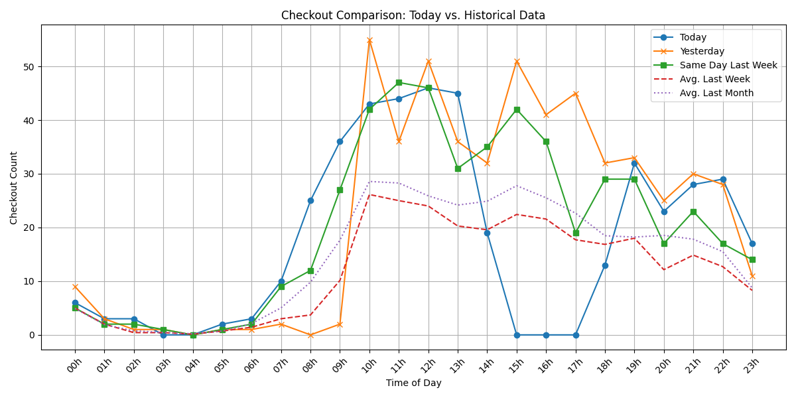
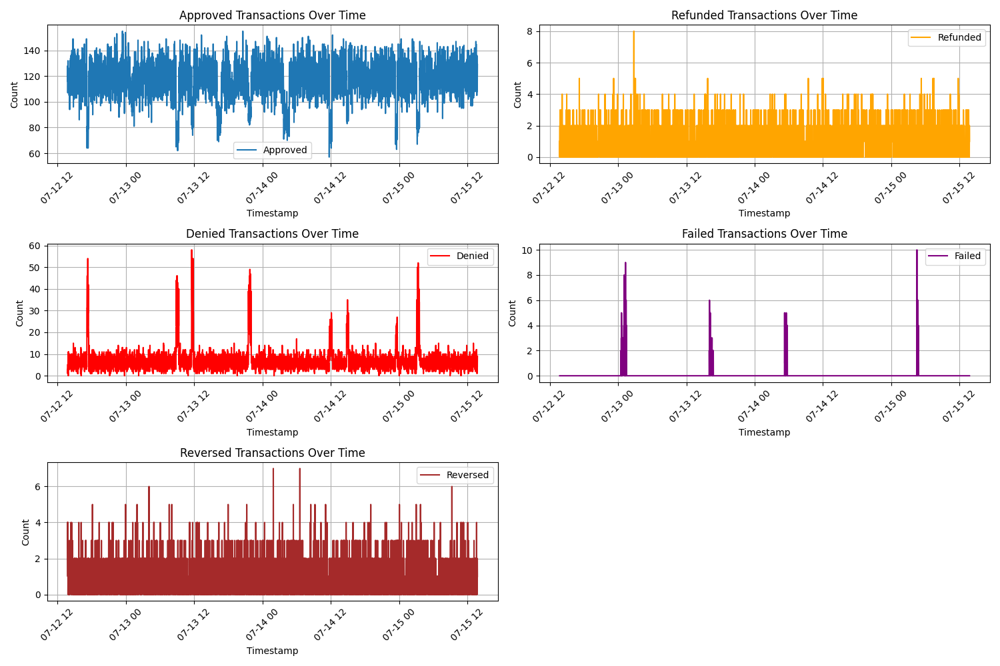
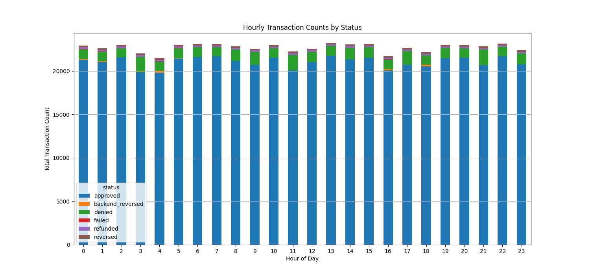
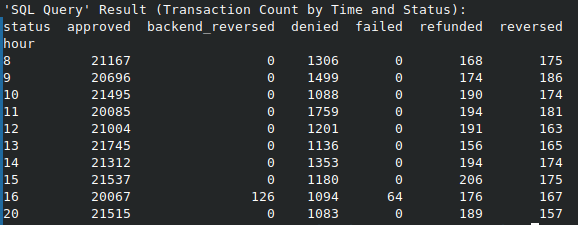
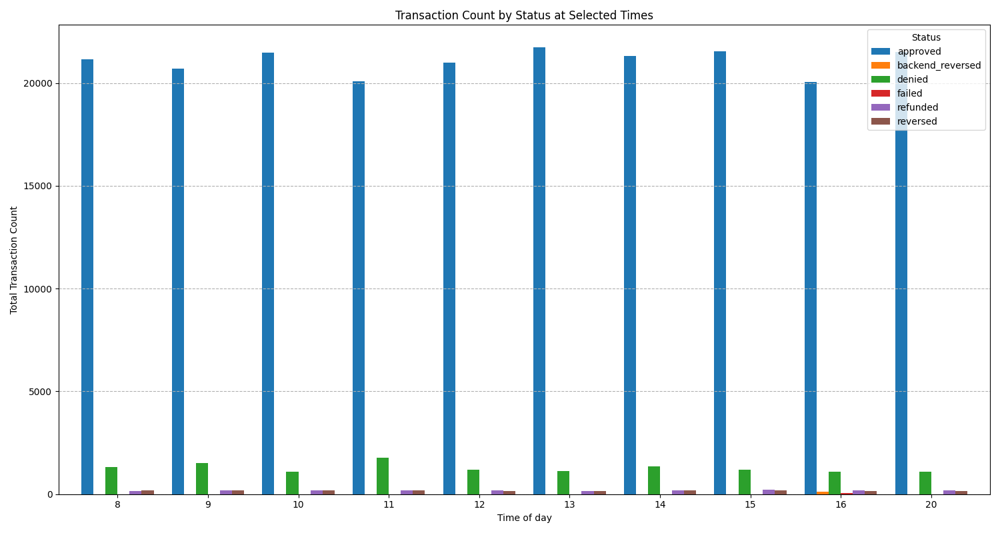

# Monitoring Analyze Test

This project implements a complete, virtualized monitoring environment for analyzing transaction data from CSV files. The stack uses Python to understand anomaly behavior, Prometheus for collecting and storing metrics, Grafana for visualization and dashboards, and a custom Go Exporter to read the data and expose it to Prometheus. The entire environment is orchestrated with Docker and Docker Compose, making it portable and easy to configure.

### Analyzing CSVs

**Setup environment**

To begin the analysis, we'll work with Python and its pandas and matplotlib libraries. To do this, we need to install them. Before doing so, create your virtual environment within the `/data-analysis` folder. Run the following command:

```
pip install virtualenv
```

**Create the environment (creates a folder in /data-analysis)**

```
virtualenv env_name
```

**In Linux or Mac, activate the new python environment**
```
source env_name/bin/activate
```

**Or in Windows**
```
.\env_name\Scripts\activate
```

Now run the command below to install the libs we need:
```
pip install -r requirements.txt
```


**Analyzing behavior**

To understand checkout behavior, let's compare today's data with historical data (yesterday, same day last week, last week's average, and last month's average). Run ``python3 plotting.py``, The graph below will be generate and illustrates this comparison.




**Observations and Anomalies:**

Abnormal spikes at 8:00hrs - 9:00hrs and 20:00hrs: Note that there is an extremely sharp increase in the number of checkouts "today" at 8:00 hrs and 9:00 hrs, and another spike at 8:00 hrs. These values are much higher than all historical metrics, suggesting atypical behavior.

Anomalous drop at 15:00 hrs: There was a drop to zero in the number of checkouts at 15:00 hrs, which is unusual compared to the data from "yesterday" and "the same day last week." This may indicate a possible instability or technical issue.

**Transactions by Status Over Time**

This chart shows the transaction count for each status over time. Due to the large amount of data, it is easier to observe overall patterns and volatility.




**Transaction Count by Hour and Status**

When the data was aggregated hourly, a clearer view of daily patterns was obtained:



**Observations:**

Predominance of "approved" transactions: The vast majority of transactions are approved, which is expected.

Hourly Patterns: Transaction activity appears to increase throughout the day, with peaks at certain times, which is a common business pattern.

**Conclusion and Recommendations**

Analysis of checkout data reveals clear and significant anomalies that should be investigated:

Checkout Spikes (8:00hrs - 9:00hrs and 20hrs): Checkout spikes can be the result of:

Marketing actions: A successful campaign or promotion may have generated a sudden increase in traffic and conversions.

Fraudulent Activity: Such a drastic increase could also be a sign of bot activity or fraud attempts.

Specific Event: An external event may have led to this behavior.

Checkout Drop (15:00hrs): A drop to zero is a strong indication of:

Technical Issues: There may have been a failure in the checkout system, payment gateway, or some other part of the infrastructure.

### Explaining anomaly behavior

To further analyze the anomalous behavior, I simulated a SQL query on the transaction data to focus on the times we identified as problematic (8hrs, 9 AM, 15hrs, and 20hrs).

The "query" performed was essentially:

```
SELECT HOUR(timestamp), status, SUM(count)
FROM transactions
WHERE HOUR(timestamp) IN (8, 9, 10, 11, 12, 13, 14, 15, 16, 20)
GROUP BY HOUR(timestamp), status;
```
Run ``python3 sql.py`` to generate the output below:



I created a bar chart from the output to visualize the distribution of transaction statuses at these specific times.




**Explanation of Anomalous Behavior**

By comparing the information from checkout_2.csv with this new view of transactions.csv, we can formulate much more precise hypotheses:

1. **The Drastic Drop in Checkouts at 15hrs**

**Checkout Anomaly:** The first log (checkout_2.csv) showed zero checkouts at 3 PM.

**Transaction Analysis:** The graph above shows that at 15hrs, there was a normal transaction volume, with 21,537 "approved" transactions and others within the expected range.

**Conclusion:** This is a crucial contradiction. The most likely explanation is that the checkout system was working correctly, but the system that records the checkout logs failed specifically at 15 hrs. The problem wasn't a drop in sales, but rather a failure in monitoring or data collection.

2. **Checkout Spikes at 8:00hrs - 9:00hrs**

**Checkout Anomaly:** The first log showed an extreme spike in checkouts at these times.

**Transaction Analysis:** The transaction graph reveals that, along with the high volume of approved transactions, 8:hrs and 9:00hrs had the highest volume of "denied" transactions compared to other times.

**Conclusion:** The checkout spike was not entirely due to successful sales. The disproportionate increase in denied transactions may indicate:

**Fraud Attempts:** A "card testing" attack, where fraudsters mass-test a list of stolen credit cards. Most are denied, but it generates a high volume of checkout attempts.

**Misdirected Marketing Campaign:** A campaign that attracted an audience without sufficient funds, resulting in many denied purchase attempts.

3. **The 20 hrs Checkout Spike**

**Checkout Anomaly:** There was also a checkout spike at 20 hrs.

**Transaction Analysis:** Unlike 8hrs – 9hrs, the distribution of transaction statuses at 20hrs appears normal, with no significant increase in declined or failed transactions.

**Conclusion:** This 20hrs spike appears to be a legitimate increase in customer traffic, perhaps due to it being a prime time for online shopping.

4. **New Anomaly Found at 16hrs**

**Transaction Analysis:** Our SQL query revealed something not visible in the checkout data: at 16 hrs, transactions with "backend_reversed" and "failed" statuses appeared, which did not appear at the other times analyzed.

**Conclusion:** This indicates that a new type of technical issue may have started occurring after 16hrs, possibly related to communication failures with the payment system or backend issues.

In short, by combining the two data sources, we can go beyond simply identifying "spikes" and "dips" and begin to understand the potential causes behind each anomaly, separating likely technical failures from potential fraudulent activity or legitimate traffic spikes.

### Monitoring stack

**Architectural overview**

The data flow follows the Prometheus *pull* model:


1. **Transaction Exporter**: A custom service written in Go that reads the `transactions.csv` and `checkout_2.csv` files in real time. It processes this data and exposes it to an HTTP endpoint (`/metrics`) in a format Prometheus understands.
2. **Prometheus:** The Prometheus server is configured to scrape data from our exporter's `/metrics` endpoint at regular intervals. It stores these metrics in its time series database.
3. **Grafana:** Grafana connects to Prometheus as a data source. It queries Prometheus using PromQL and displays the data in interactive, visual dashboards, allowing analysis of transaction and checkout behavior.

**Prerequisites**
Before you begin, ensure you have the following software installed:

[Docker](https://docs.docker.com/get-started/get-docker/)
[Docker Compose](https://docs.docker.com/compose/install/)

**Como Executar**

1. **Clone the repository** and make sure your `transactions.csv` and `checkout_2.csv` files are in the `data/` folder.
2. Open a terminal in the project root folder (`monitoring-stack/`).
3. Run the following command to build the images and start the containers:

```
docker compose up --build -d
```
4. Please wait a few moments. Services will be available at the following addresses:
- **Grafana**: `http://localhost:3000`
- **Prometheus**: `http://localhost:9090`
- **Exporter Metrics**: `http://localhost:8081/metrics`

**Configuration of Grafana (First time)**

1. **Access Grafana** in `http://localhost:3000`.
2. **Login:** use `admin` for user and `admin` for password.
3. **Add Prometheus as a Data Source:**
    - Go to **Connections -> Data Sources -> Add data source**.
    - Select **Prometheus**.
    - In the **Prometheus server URL** field, type `http://prometheus:9090`.
    - Click in **Save & test**.

# Dashboard Ideas to Create

### Section 1: Real-Time Monitoring (Transactions)

| Dashboard Title | Visualization Type | PromQL Query(s) | Purpose |
| :--- | :--- | :--- | :--- |
| **Transaction Status (Now)** | `Stat` | `transaction_stats_total{status="approved"}`<br>`transaction_stats_total{status="denied"}`<br>`transaction_stats_total{status="failed"}` | Provides the most important KPIs on transaction health in real time. Use thresholds for colors. |
| **Current Failure Rate** | `Gauge` | `100 * ( (transaction_stats_total{status="failed"} or vector(0)) / ( (transaction_stats_total{status="approved"} or vector(0)) + (transaction_stats_total{status="failed"} or vector(0)) > 0 ) ) or vector(0)` | Shows the percentage of failed transactions out of the total, a crucial health indicator. |
| **Transaction Status History** | `Time series` | `transaction_stats_total` (Legend: `{{status}}`) | Shows the trend of each status over time, allowing you to identify peaks, troughs, and correlations. |
| **Status Distribution (Pizza)** | `Pie chart` | `sum_over_time(transaction_stats_total[$__range])` |Displays the proportion of each status in the selected period, ideal for reporting and overview. |

### Section 2: Daily Performance Analysis (Checkouts)

| Dashboard Title | Visualization Type | PromQL Query(s) | Purpose |
| :--- | :--- | :--- | :--- |
| **Checkouts by Hour (Today vs Yesterday)** | `Bar chart` | A: `checkout_stats_count{comparison="today"}`<br>B: `checkout_stats_count{comparison="yesterday"}` | Visually compares hour-by-hour checkout volume between the current day and the previous day. |
| **Today's Performance vs Averages** | `Time series` | `checkout_stats_count{comparison=~"today\|avg_last_week\|avg_last_month"}` | Compares today's performance to historical averages to quickly identify abnormal behavior. |
| **Checkout Anomalies Table** | `Table` | `checkout_stats_count{comparison="today"} == 0 and checkout_stats_count{comparison="yesterday"} > 0` | Creates an active alert list, showing the hours when checkout volume unexpectedly dropped to zero. |
| **Checkout Heatmap** | `Heatmap` | `checkout_stats_count` | Shows the "density" of checkouts, highlighting the highest volume hours for each comparison with warm colors. |

**Example:**


## Troubleshooting

- **Metrics do not appear in Grafana/Prometheus:**
1. Check the exporter logs: `docker compose logs -f transaction-exporter`.
2. Check the Prometheus Targets page: `http://localhost:9090/targets`. The `State` of `transaction-exporter` should be `UP`.
3. Check the metrics output directly in the exporter: `http://localhost:8081/metrics`.

- **Error building image (`docker compose up --build`):**
- Check that the Go version in the `Dockerfile` (`FROM golang:...`) is compatible with your `go.mod`.
- Perform a full environment cleanup to remove old containers and images: `docker compose down -v` followed by `docker image rm <image_name>`.